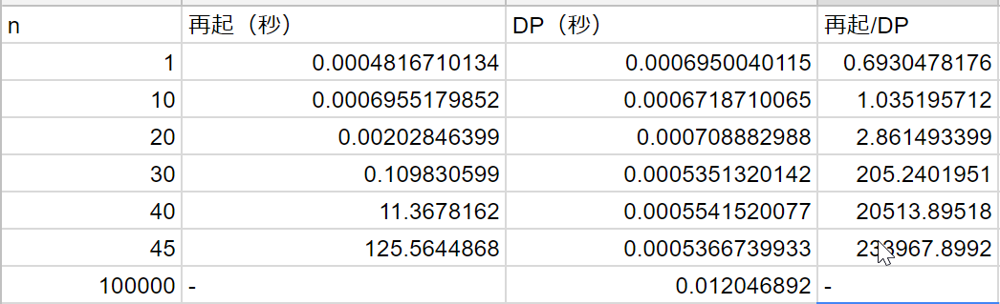

@snap[text-20 text-bold]
DP（動的計画法）
@snapend
@snap[text-10]
の入り口の入り口
 

 
～ TLE から始まる恋もある ～
@snapend

---

### 自己紹介

周藤 史裕

- 今年の正月太り： 3.0kg

- 趣味：
  - 酒、歌
  - @css[text-blue fragment](最近 AtCoder はじめました)

---

## AtCoder 以前の私

---

- たまに TOPSIC の納品問題を確認のため解いていた
  - TLEになるくらいの問題が好き
    - 考え方は合ってるかもしれないがアルゴリズムが悪い
  - TLE を AC にできたときのカタルシス
  - (でも たまに Ruby のせいにする)

---

昨年 12 月 AtCoder のコンテストになんとなく初参加

---

- コンテスト終了後の解説動画や受験者のツイートが勉強になることを知った
  - 動的計画法（DP）とやらを知る
    - （´-`）.｡oO（名前からして難しそう・・）
    - （´-`）.｡oO（TLEに効果あるかも？？？）
    - （´-`）.｡oO（・・・ちょっとだけ勉強してみようかな・・）

---

## DP（動的計画法）とは

 

- 知っている人？

---

## DP（動的計画法）とは

#### めちゃくちゃ簡単にポイントだけ（しかも間違ってる可能性大）

- 同じ探索（計算）を２度しない
- 探索済みの値は使い回す

 

- @css[text-blue](実際見た方が早いです！)

---

## 例）フィボナッチ数列の計算

- 0, 1, 1, 2, 3, 5, 8, 13, 21, 34, 55, ...

というように直前の 2 つの項の和を繰り返す数列（ただし最初の２項は 0、1）
の n 項を求めるプログラムを作成しなさい

---

## いままでの私は・・何も考えずに再帰・・・

---

## Ruby で実装してみた

---

@snap[west span-50]

再帰

@size[0.5em](普通の再帰。n項のフィボナッチ数列を計算するときは、n未満のフィボナッチ数列をすべて計算。しかもそれが再帰。。)

@snapend

@snap[east span-50]

DP

@snapend

---

### 再帰

普通の再帰
n項のフィボナッチ数列を計算するときは、n未満のフィボナッチ数列をすべて計算。
しかもそれが再帰。。

### DP

- n項までのフィボナッチ数列を格納するための配列を用意
- 1からnまで順番にフィボナッチ数列を計算する。
  - 一度計算した値は使い回される

---

再帰だと何桁くらいまで求められるのか？

---

### 比較

- 再起は@css[text-blue](指数的)に処理時間が増加
- DP は@css[text-blue](線形的)に処理時間が増加
  - （ガチ計測のため環境のせいか増加してるように見えませんが・・）

---

## まとめ

- 競プロ楽しいし、業務にも役立ちそうな気がします
- フィボナッチ数列は単純すぎるので DP の威力を知るには物足りなかったと思います。。

---

### おまけ 1：動的計画法の資料

- https://qiita.com/drken/items/a5e6fe22863b7992efdb
- https://www.slideshare.net/iwiwi/ss-3578511
- https://www.slideshare.net/chokudai/wap-atcoder3

---

### おまけ 2：問題解きたい人

- https://atcoder.jp/contests/dp
- https://atcoder.jp/contests/tdpc
